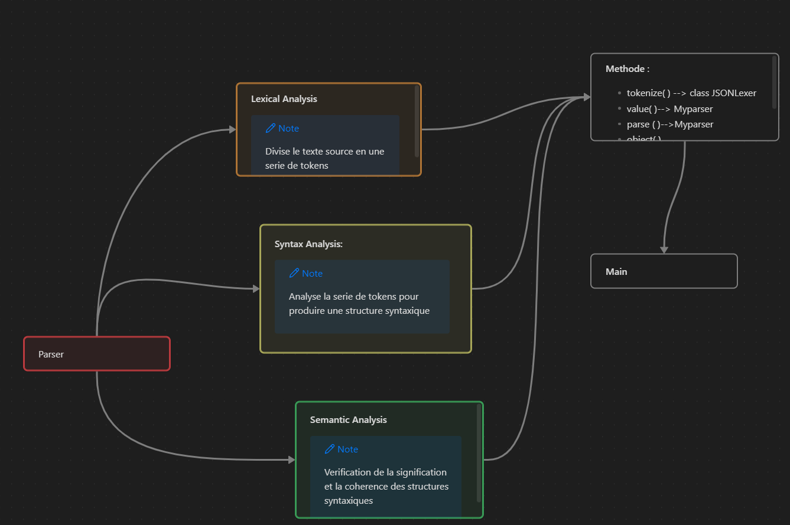

# Projet SMA 

## Conception Parser en python

**Objectif : Concevoir un parser avec python pour parser les fichier Json derivannt du service proojet.**

Architecture :

S

Exécuter à partir du fichier :
main.py
